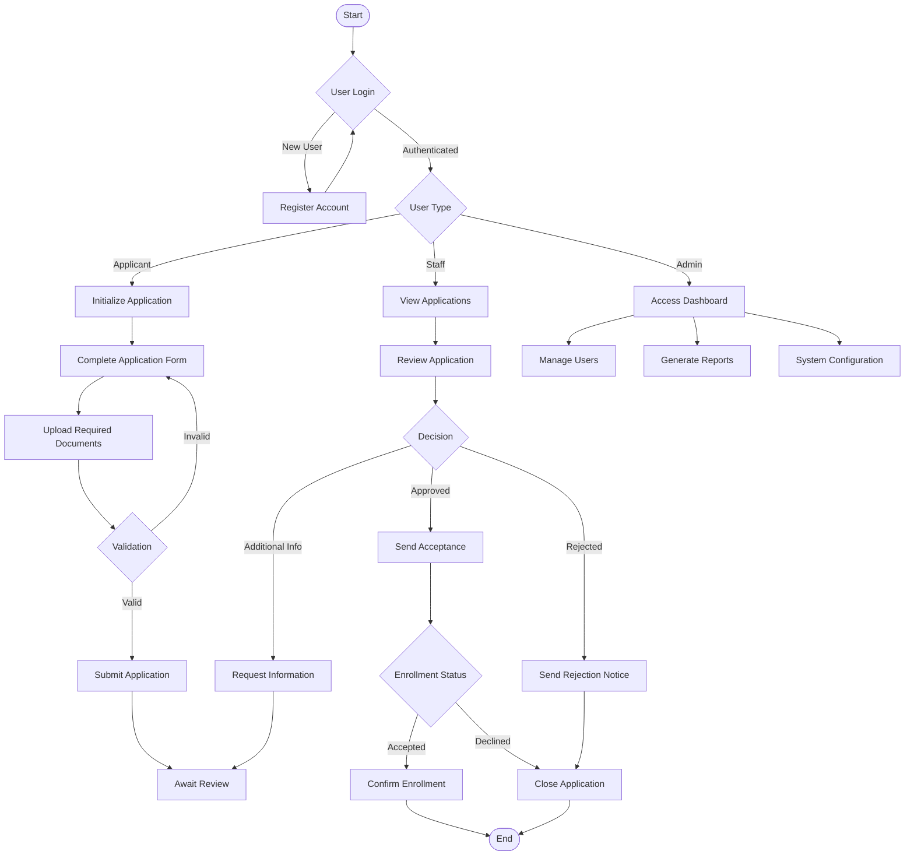
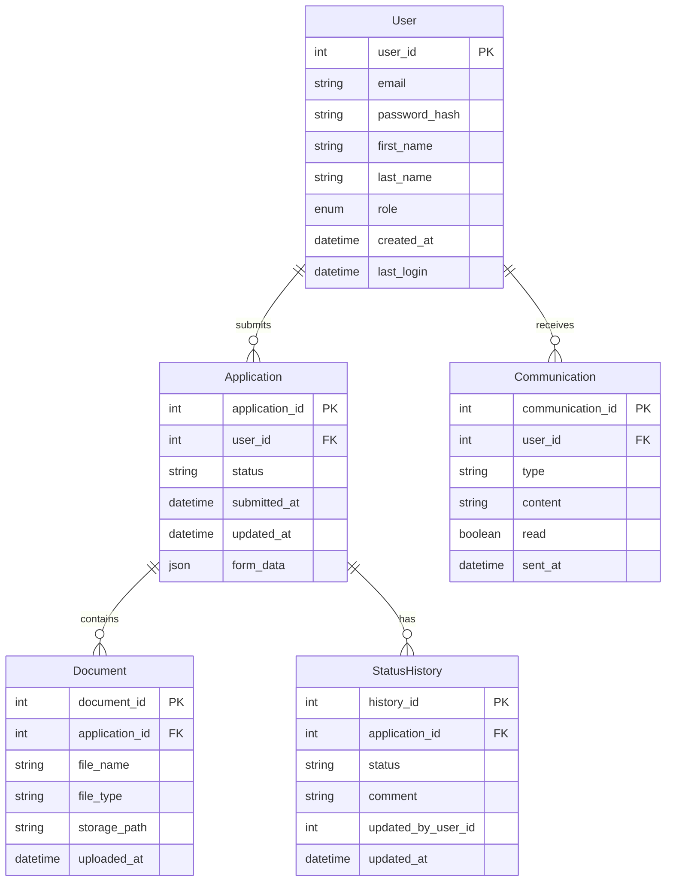
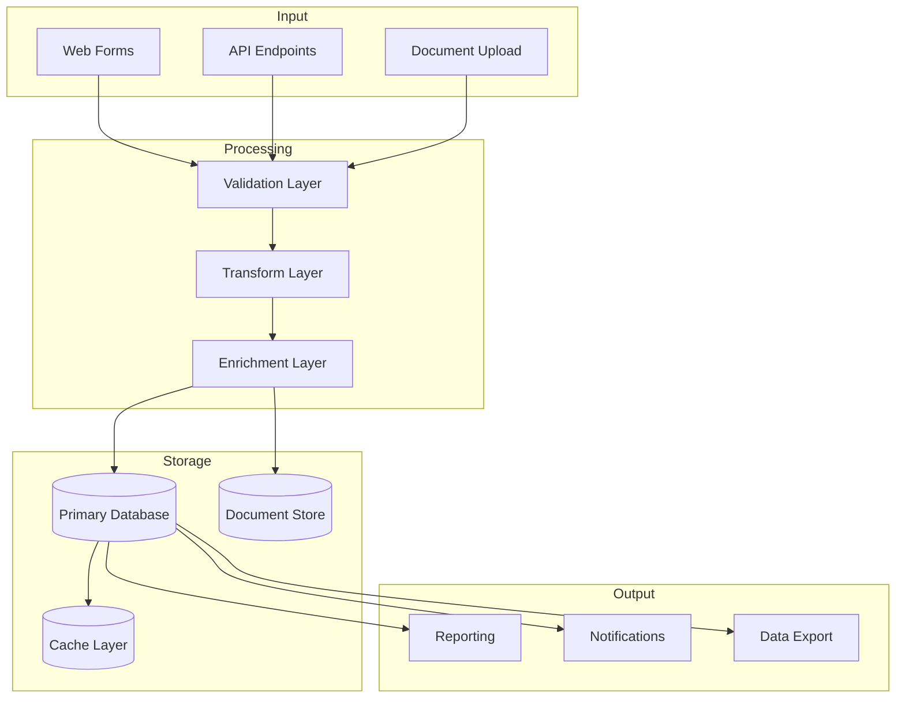
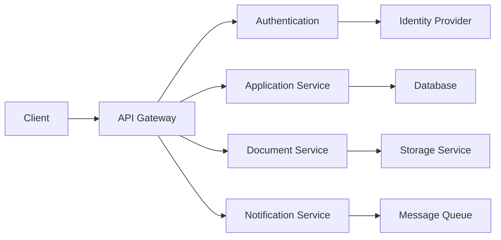

# Product Requirements Document (PRD)

# 1. INTRODUCTION

## 1.1 Purpose
This Software Requirements Specification (SRS) document provides a comprehensive description of the implementation requirements for the enrollment system. It is intended for:
- Development teams responsible for implementing the system
- Quality assurance teams for testing validation
- Project stakeholders and business analysts
- System architects and designers
- Maintenance teams who will support the system

## 1.2 Scope
The enrollment system will provide a web-based platform for managing the complete enrollment process. The system will:

- Handle user authentication and authorization
- Process and validate enrollment applications
- Manage enrollment status tracking
- Generate enrollment-related documentation
- Provide status notifications to users
- Store and manage enrollment data securely
- Support administrative workflows and approvals
- Enable reporting and analytics capabilities

Key benefits include:
- Streamlined enrollment process
- Reduced manual processing time
- Improved data accuracy and consistency
- Enhanced user experience through self-service capabilities
- Real-time status tracking and updates
- Centralized data management
- Automated workflow management

The system will be implemented as a web application using modern web technologies and frameworks, ensuring scalability, security, and maintainability.

# 2. PRODUCT DESCRIPTION

## 2.1 Product Perspective
The enrollment system operates as a standalone web application that integrates with existing institutional infrastructure. The system:

- Interfaces with existing student information databases
- Connects to authentication services for single sign-on capabilities
- Integrates with email/notification systems
- Supports document management systems for file storage
- Provides APIs for potential future integrations
- Complies with institutional data security standards

## 2.2 Product Functions
The enrollment system provides the following core functions:

- User Management
  - Self-registration and profile management
  - Role-based access control
  - Password recovery and account management

- Application Processing
  - Online application form submission
  - Document upload and verification
  - Application status tracking
  - Automated validation checks

- Enrollment Management
  - Application review workflows
  - Approval/rejection processing
  - Waitlist management
  - Enrollment confirmation

- Communication
  - Automated email notifications
  - In-system messaging
  - Status updates and alerts
  - Bulk communication capabilities

- Reporting
  - Enrollment statistics and analytics
  - Custom report generation
  - Data export capabilities
  - Dashboard visualizations

## 2.3 User Characteristics

| User Type | Characteristics | Technical Expertise |
|-----------|----------------|-------------------|
| Applicants | - Age range: 16-65+   - Various educational backgrounds   - Different device preferences | Basic computer literacy |
| Enrollment Staff | - Administrative professionals   - Full-time employees   - Regular system users | Intermediate computer skills |
| Reviewers | - Faculty members   - Department heads   - Part-time system usage | Basic to intermediate computer skills |
| System Administrators | - IT professionals   - Technical support staff | Advanced technical expertise |

## 2.4 Constraints
- Technical Constraints
  - Must support modern web browsers (Chrome, Firefox, Safari, Edge)
  - Must maintain response times under 3 seconds
  - Must handle concurrent users during peak enrollment periods
  - Must comply with WCAG 2.1 accessibility standards

- Regulatory Constraints
  - Must comply with data protection regulations
  - Must maintain audit trails for all transactions
  - Must implement required security controls
  - Must adhere to institutional privacy policies

- Operational Constraints
  - System maintenance windows limited to off-peak hours
  - Must support 24/7 availability with 99.9% uptime
  - Must integrate with existing institutional systems
  - Must operate within current IT infrastructure

## 2.5 Assumptions and Dependencies
Assumptions:
- Users have access to internet-connected devices
- Institution maintains stable network infrastructure
- Support staff available during business hours
- Basic computer literacy among all user groups
- Stable internet connectivity at institution locations

Dependencies:
- Availability of institutional authentication services
- Access to student information databases
- Email server functionality
- Document storage system capacity
- Network bandwidth and reliability
- Third-party integration availability
- Browser compatibility and updates

# 3. PROCESS FLOWCHART

# 4. FUNCTIONAL REQUIREMENTS

## 4.1 User Authentication and Management

### ID: F-001
### Description
Secure user authentication and management system supporting multiple user roles and permissions.
### Priority: High

| Requirement ID | Requirement Description | User Story |
|---------------|------------------------|------------|
| F-001-1 | Support self-registration for applicants | As an applicant, I want to create my own account to access the enrollment system |
| F-001-2 | Implement role-based access control (RBAC) | As an administrator, I want to assign specific permissions to different user roles |
| F-001-3 | Enable password reset functionality | As a user, I want to securely reset my password if forgotten |
| F-001-4 | Provide single sign-on (SSO) integration | As a user, I want to use my institutional credentials to access the system |
| F-001-5 | Support user profile management | As a user, I want to update my personal information and preferences |

## 4.2 Application Processing

### ID: F-002
### Description
Comprehensive application submission and processing system with document management capabilities.
### Priority: High

| Requirement ID | Requirement Description | User Story |
|---------------|------------------------|------------|
| F-002-1 | Provide dynamic application forms | As an applicant, I want to fill out and submit my application online |
| F-002-2 | Support document upload and verification | As an applicant, I want to upload required documents in common formats |
| F-002-3 | Implement application validation | As the system, I want to validate applications for completeness and accuracy |
| F-002-4 | Enable application draft saving | As an applicant, I want to save my application progress and continue later |
| F-002-5 | Provide application editing capabilities | As an applicant, I want to edit my submitted application within allowed timeframes |

## 4.3 Enrollment Management

### ID: F-003
### Description
Workflow management system for processing and tracking enrollment applications.
### Priority: High

| Requirement ID | Requirement Description | User Story |
|---------------|------------------------|------------|
| F-003-1 | Support application review workflow | As staff, I want to review and process applications efficiently |
| F-003-2 | Implement approval/rejection processing | As staff, I want to approve or reject applications with appropriate notifications |
| F-003-3 | Enable waitlist management | As staff, I want to manage waitlisted applications automatically |
| F-003-4 | Provide enrollment confirmation | As an applicant, I want to confirm my enrollment after acceptance |
| F-003-5 | Track enrollment status | As staff, I want to monitor the status of all applications in real-time |

## 4.4 Communication System

### ID: F-004
### Description
Automated communication system for notifications and updates.
### Priority: Medium

| Requirement ID | Requirement Description | User Story |
|---------------|------------------------|------------|
| F-004-1 | Send automated email notifications | As the system, I want to send automatic notifications for important events |
| F-004-2 | Provide in-system messaging | As a user, I want to send and receive messages within the system |
| F-004-3 | Enable bulk communications | As staff, I want to send mass communications to specific user groups |
| F-004-4 | Support notification preferences | As a user, I want to customize my notification preferences |
| F-004-5 | Maintain communication history | As a user, I want to access my communication history |

## 4.5 Reporting and Analytics

### ID: F-005
### Description
Comprehensive reporting system with analytics capabilities.
### Priority: Medium

| Requirement ID | Requirement Description | User Story |
|---------------|------------------------|------------|
| F-005-1 | Generate standard reports | As staff, I want to generate predefined enrollment reports |
| F-005-2 | Support custom report creation | As staff, I want to create custom reports based on specific criteria |
| F-005-3 | Provide dashboard visualizations | As staff, I want to view enrollment metrics through interactive dashboards |
| F-005-4 | Enable data export | As staff, I want to export report data in common formats |
| F-005-5 | Track system analytics | As an administrator, I want to monitor system usage and performance metrics |

# 5. NON-FUNCTIONAL REQUIREMENTS

## 5.1 Performance Requirements

| Requirement | Description | Target Metric |
|------------|-------------|---------------|
| Response Time | Maximum time for page loads and operations | < 3 seconds for 95% of requests |
| Throughput | Number of concurrent users supported | 1000 simultaneous users |
| Database Performance | Query response time | < 1 second for 90% of queries |
| File Upload | Maximum file upload time | < 30 seconds for files up to 25MB |
| API Response | API endpoint response time | < 500ms for 95% of requests |
| Resource Usage | Server CPU and memory utilization | < 75% under peak load |

## 5.2 Safety Requirements

| Requirement | Description |
|------------|-------------|
| Data Backup | Daily automated backups with 30-day retention |
| Disaster Recovery | Recovery Time Objective (RTO) of 4 hours |
| Failover | Automatic failover to backup systems |
| Data Integrity | Transaction rollback mechanisms for failed operations |
| Error Handling | Graceful error handling with user-friendly messages |
| Session Management | Automatic session timeout after 30 minutes of inactivity |

## 5.3 Security Requirements

| Requirement | Description |
|------------|-------------|
| Authentication | Multi-factor authentication support |
| Authorization | Role-based access control (RBAC) |
| Data Encryption | TLS 1.3 for data in transit; AES-256 for data at rest |
| Password Policy | Minimum 12 characters with complexity requirements |
| Audit Logging | Comprehensive audit trails for all system actions |
| Session Security | Encrypted session tokens with secure cookie settings |
| Input Validation | Server-side validation for all user inputs |
| Security Headers | Implementation of OWASP recommended security headers |

## 5.4 Quality Requirements

### 5.4.1 Availability
- System uptime of 99.9% during operational hours
- Planned maintenance windows during off-peak hours
- Maximum unplanned downtime of 1 hour per month

### 5.4.2 Maintainability
- Modular architecture for easy component updates
- Comprehensive system documentation
- Automated deployment processes
- Version control for all system components

### 5.4.3 Usability
- WCAG 2.1 Level AA compliance
- Intuitive navigation requiring no special training
- Mobile-responsive design
- Support for multiple languages
- Context-sensitive help system

### 5.4.4 Scalability
- Horizontal scaling capability for increased load
- Support for 20% annual user growth
- Microservices architecture for independent scaling
- Cloud-native design principles

### 5.4.5 Reliability
- Mean Time Between Failures (MTBF) > 720 hours
- Mean Time To Repair (MTTR) < 2 hours
- Automated system health monitoring
- Self-healing capabilities for common issues

## 5.5 Compliance Requirements

| Requirement | Description |
|------------|-------------|
| Data Protection | GDPR and local data protection regulations compliance |
| Accessibility | WCAG 2.1 Level AA standards compliance |
| Security Standards | ISO 27001 security controls implementation |
| Education Standards | Compliance with relevant education sector standards |
| Privacy | Privacy Impact Assessment (PIA) requirements |
| Documentation | Maintenance of compliance documentation and certifications |
| Audit | Support for regular compliance audits |
| Data Retention | Implementation of data retention policies |

# 6. DATA REQUIREMENTS

## 6.1 Data Models

## 6.2 Data Storage

### 6.2.1 Database Requirements
- Primary Database: PostgreSQL 14+ for transactional data
- Document Store: MongoDB for unstructured application data
- Cache Layer: Redis for session management and frequent queries

### 6.2.2 Storage Specifications
- Initial storage allocation: 500GB
- Expected annual growth: 200GB
- Document storage capacity: 2TB
- Database partitioning by enrollment year
- Indexing on frequently queried fields

### 6.2.3 Data Retention
- Active applications: Indefinite retention
- Rejected applications: 2 years
- Withdrawn applications: 1 year
- System logs: 1 year
- Audit trails: 7 years
- Communications: 3 years

### 6.2.4 Backup and Recovery
- Full daily backups with 30-day retention
- Point-in-time recovery capability
- 15-minute incremental backups
- Geographic replication to secondary data center
- Maximum data loss tolerance: 15 minutes
- Recovery Time Objective (RTO): 4 hours

## 6.3 Data Processing

### 6.3.1 Data Flow

### 6.3.2 Data Security
- Encryption at rest using AES-256
- TLS 1.3 for data in transit
- Field-level encryption for sensitive data
- Data masking for non-production environments
- Row-level security implementation
- Regular security audits and penetration testing

### 6.3.3 Data Validation
- Input sanitization for all user data
- Schema validation for API payloads
- Document format verification
- Size and type restrictions for uploads
- Business rule validation
- Duplicate detection

### 6.3.4 Data Integration
- REST API for external system integration
- Batch processing capabilities
- Real-time event streaming
- ETL processes for reporting
- Data synchronization protocols
- Error handling and retry mechanisms

# 7. EXTERNAL INTERFACES

## 7.1 User Interfaces

### 7.1.1 Web Interface Requirements
- Responsive design supporting viewport sizes from 320px to 4K
- Material Design 3 component library implementation
- Minimum touch target size of 44x44 pixels
- Maximum content width of 1440px
- Color contrast ratio minimum 4.5:1
- Loading state indicators for operations >500ms

### 7.1.2 Key Interface Components

| Component | Description | Priority |
|-----------|-------------|----------|
| Dashboard | Personalized landing page with role-specific widgets | High |
| Application Form | Multi-step form with progress indicator | High |
| Document Upload | Drag-and-drop interface with preview capability | Medium |
| Status Tracker | Visual timeline of application progress | Medium |
| Notification Center | Centralized message and alert display | Medium |
| Report Builder | Interactive report configuration interface | Low |

## 7.2 Hardware Interfaces

### 7.2.1 Client Hardware Requirements
- Minimum display resolution: 1280x720
- Supported input devices: Mouse, keyboard, touch screen
- Minimum 2GB available RAM
- Storage space for document caching: 1GB
- Network bandwidth: 1Mbps minimum

### 7.2.2 Server Hardware Requirements
- CPU: 8+ cores at 2.5GHz
- RAM: 32GB minimum
- Storage: NVMe SSD with 1000 IOPS
- Network Interface: 10Gbps
- Redundant power supply

## 7.3 Software Interfaces

### 7.3.1 External System Integration

| System | Interface Type | Protocol | Data Format |
|--------|---------------|----------|-------------|
| Student Information System | REST API | HTTPS | JSON |
| Payment Gateway | REST API | HTTPS | JSON |
| Document Management System | REST API | HTTPS | Multipart/form-data |
| Email Service | SMTP | TLS | MIME |
| Authentication Service | SAML 2.0 | HTTPS | XML |
| Analytics Platform | REST API | HTTPS | JSON |

### 7.3.2 Database Interfaces
- PostgreSQL: TCP/IP on port 5432
- MongoDB: TCP/IP on port 27017
- Redis: TCP/IP on port 6379

## 7.4 Communication Interfaces

### 7.4.1 Network Protocols
- HTTPS (TLS 1.3) for all web traffic
- WebSocket for real-time updates
- SMTP/TLS for email communications
- AMQP for message queuing
- gRPC for internal service communication

### 7.4.2 API Specifications

### 7.4.3 Integration Endpoints

| Endpoint Category | Protocol | Authentication | Rate Limit |
|------------------|----------|----------------|------------|
| Public API | REST/HTTPS | JWT | 100 req/min |
| Internal Services | gRPC | mTLS | 1000 req/min |
| Webhooks | HTTPS | HMAC | 50 req/min |
| File Transfer | SFTP | SSH Keys | 10 MB/s |
| Event Streaming | WebSocket | JWT | 1000 msg/min |

# 8. APPENDICES

## 8.1 GLOSSARY

| Term | Definition |
|------|------------|
| Enrollment | The process of officially registering and joining an educational institution |
| Waitlist | A list of applicants who may be admitted if space becomes available |
| Single Sign-On (SSO) | Authentication process that allows users to access multiple systems with one set of credentials |
| Document Verification | Process of validating the authenticity and completeness of submitted documents |
| Role-Based Access | System of restricting network access based on a person's role within an organization |
| Point-in-time Recovery | Ability to restore database to a specific moment in time |
| Data Masking | Process of hiding original data with modified content |
| Touch Target | Interactive element size on touch-enabled devices |

## 8.2 ACRONYMS

| Acronym | Definition |
|---------|------------|
| API | Application Programming Interface |
| RBAC | Role-Based Access Control |
| SSO | Single Sign-On |
| WCAG | Web Content Accessibility Guidelines |
| TLS | Transport Layer Security |
| MTBF | Mean Time Between Failures |
| MTTR | Mean Time To Repair |
| RTO | Recovery Time Objective |
| ETL | Extract, Transform, Load |
| GDPR | General Data Protection Regulation |
| JWT | JSON Web Token |
| mTLS | Mutual Transport Layer Security |
| SFTP | Secure File Transfer Protocol |
| HMAC | Hash-based Message Authentication Code |
| IOPS | Input/Output Operations Per Second |
| AMQP | Advanced Message Queuing Protocol |
| gRPC | Google Remote Procedure Call |

## 8.3 ADDITIONAL REFERENCES

| Reference | Description | URL |
|-----------|-------------|-----|
| Material Design 3 | UI component library specifications | https://m3.material.io/ |
| OWASP Security Standards | Web application security best practices | https://owasp.org/standards/ |
| PostgreSQL Documentation | Database technical documentation | https://www.postgresql.org/docs/ |
| MongoDB Documentation | Document store technical documentation | https://docs.mongodb.com/ |
| Redis Documentation | Cache layer technical documentation | https://redis.io/documentation |
| WCAG 2.1 Guidelines | Web accessibility standards | https://www.w3.org/WAI/WCAG21/Understanding/ |
| ISO 27001 | Information security management standards | https://www.iso.org/isoiec-27001-information-security.html |