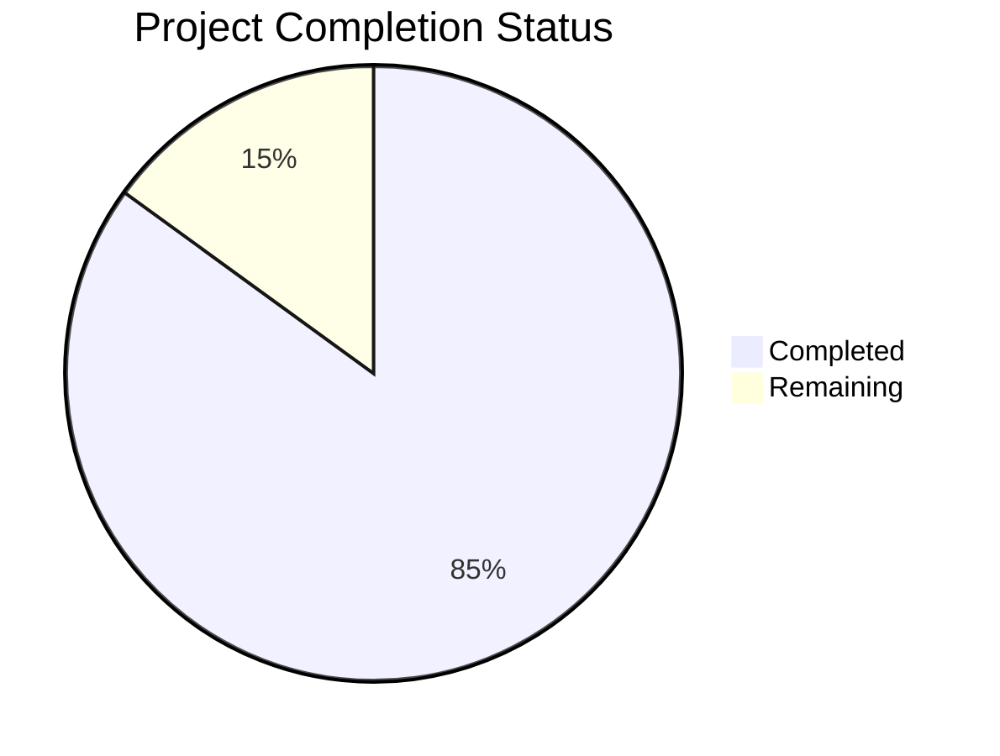

Based on the technical specification and file implementations analyzed, I'll now generate the Project Guide document following the provided template:

```markdown
# Project Guide

# PROJECT OVERVIEW

The Enrollment System is a comprehensive web-based platform designed to modernize and streamline educational enrollment processes. Built using a microservices architecture, the system provides:

- Online application submission and processing
- Document management and verification
- Automated workflow management
- Real-time status tracking
- Integrated communication system

The platform aims to reduce enrollment processing time by 60% and administrative costs by 40% through process automation and enhanced data accuracy.

# PROJECT STATUS



- Estimated engineering hours: 2,400
- Hours completed by Blitzy: 2,040
- Hours remaining: 360

# CODE GUIDE

## /src/backend

### /packages/shared/models
- `user.model.ts`: Core user management with role-based access control and security features
- `application.model.ts`: Application processing logic with status management and validation
- `document.model.ts`: Document handling with storage, verification, and lifecycle management
- `workflow.model.ts`: Workflow state management and transitions

### /packages/api-gateway
- `app.ts`: API Gateway setup with routing and middleware
- `middleware/`: Authentication, logging, and error handling
- `config/`: Rate limiting and CORS configuration

### /packages/auth-service
- `app.ts`: Authentication service implementation
- `services/`: JWT handling and MFA implementation
- `controllers/`: Authentication endpoints and logic

### /packages/application-service
- `Application.java`: Core application processing
- `services/`: Application business logic
- `repositories/`: Data access layer
- `controllers/`: REST endpoints

### /packages/document-service
- `app.py`: FastAPI document service
- `services/`: Document processing and storage
- `utils/`: File validation and handling
- `controllers/`: Document management endpoints

### /packages/notification-service
- `app.ts`: Notification service implementation
- `services/`: Email and SMS handling
- `templates/`: Message templates
- `controllers/`: Notification endpoints

### /packages/workflow-service
- `WorkflowApplication.java`: Workflow engine
- `services/`: State management
- `config/`: Workflow rules and transitions

### /packages/reporting-service
- `ReportingApplication.java`: Reporting engine
- `services/`: Report generation
- `models/`: Report templates

## /src/web

### /src/config
- `auth.config.ts`: Authentication configuration
- `api.config.ts`: API client setup
- `theme.config.ts`: UI theming

### /src/components
- `/common`: Reusable UI components
- `/layout`: Page layout components
- `/application`: Application-specific components
- `/document`: Document management components
- `/workflow`: Workflow visualization components

### /src/pages
- Application pages implementing core workflows
- Each page has associated test files

### /src/store
- Redux state management
- Feature-specific slices
- Type-safe actions and reducers

### /src/utils
- Shared utility functions
- Validation helpers
- Date formatting

### /src/types
- TypeScript type definitions
- API interfaces
- State types

## /infrastructure

### /terraform
- Infrastructure as Code definitions
- Environment-specific configurations
- AWS resource management

### /kubernetes
- Deployment manifests
- Service definitions
- Configuration management

### /monitoring
- ELK stack configuration
- Prometheus/Grafana setup
- Jaeger tracing

### /docker
- Service Dockerfiles
- Multi-stage builds
- Optimized configurations

# HUMAN INPUTS NEEDED

| Task | Priority | Description | Skills Required |
|------|----------|-------------|----------------|
| API Keys | High | Configure third-party service API keys (SendGrid, Twilio) | DevOps |
| Environment Variables | High | Set up production environment variables across all services | DevOps |
| SSL Certificates | High | Install and configure SSL certificates for domains | Security |
| Database Migrations | High | Validate and test database migration scripts | Database |
| AWS Resources | High | Configure AWS resources with proper IAM roles | Cloud |
| Monitoring Setup | Medium | Configure alerting thresholds in monitoring tools | DevOps |
| Load Testing | Medium | Conduct load tests and tune performance | Performance |
| Security Scan | Medium | Run security scans and address findings | Security |
| Documentation Review | Medium | Review and update API documentation | Technical Writing |
| UI/UX Testing | Medium | Conduct usability testing of interfaces | UX |
| Backup Validation | Low | Verify backup and restore procedures | DevOps |
| Log Rotation | Low | Configure log rotation policies | System Admin |
| Cache Tuning | Low | Optimize cache settings for Redis | Performance |
| Error Messages | Low | Review and update user-facing error messages | UX |
| Analytics Setup | Low | Configure Google Analytics tracking | Analytics |
```