# Technical Specifications

# 1. INTRODUCTION

## 1.1 Executive Summary

The Enrollment System is a comprehensive web-based platform designed to modernize and streamline the educational enrollment process. This system addresses the critical challenges of manual enrollment management, including inefficient paper-based workflows, inconsistent data handling, and limited visibility into application status. The solution will serve applicants, enrollment staff, academic reviewers, and system administrators while integrating with existing institutional infrastructure.

The platform will deliver significant operational efficiencies through process automation, enhanced data accuracy, and improved user experience, ultimately reducing enrollment processing time by an estimated 60% and administrative costs by 40%.

## 1.2 System Overview

### Project Context

| Aspect | Description |
|--------|-------------|
| Business Context | Competitive education market requiring efficient, user-friendly enrollment processes |
| Current Limitations | Manual processing, paper-based workflows, limited tracking capabilities, inconsistent communication |
| Enterprise Integration | Interfaces with student information systems, authentication services, document management, and communication platforms |

### High-Level Description

| Component | Details |
|-----------|----------|
| Primary Capabilities | - Online application submission and processing<br>- Document management and verification<br>- Automated workflow management<br>- Real-time status tracking<br>- Integrated communication system |
| Architecture | Cloud-native, microservices-based architecture with web-based front-end |
| Core Components | - Web application portal<br>- Application processing engine<br>- Document management system<br>- Workflow engine<br>- Reporting and analytics module |
| Technical Approach | Modern web technologies, API-first design, containerized deployment |

### Success Criteria

| Category | Metrics |
|----------|---------|
| Performance | - Application processing time < 5 business days<br>- System response time < 3 seconds<br>- 99.9% system availability |
| Adoption | - 95% digital application submission rate<br>- 80% user satisfaction rating<br>- 50% reduction in support queries |
| Efficiency | - 60% reduction in processing time<br>- 40% reduction in administrative costs<br>- Zero paper-based applications |

## 1.3 Scope

### In-Scope Elements

#### Core Features and Functionalities

| Feature Category | Included Components |
|-----------------|---------------------|
| User Management | - Self-registration<br>- Role-based access control<br>- Profile management<br>- Authentication/authorization |
| Application Processing | - Online form submission<br>- Document upload<br>- Application validation<br>- Status tracking |
| Workflow Management | - Automated routing<br>- Review/approval processes<br>- Waitlist management<br>- Enrollment confirmation |
| Communication | - Email notifications<br>- Status updates<br>- In-system messaging<br>- Bulk communications |
| Reporting | - Standard reports<br>- Custom report generation<br>- Analytics dashboard<br>- Data exports |

#### Implementation Boundaries

| Boundary Type | Coverage |
|--------------|----------|
| System Access | Web-based portal accessible via modern browsers |
| User Groups | Applicants, enrollment staff, reviewers, administrators |
| Geographic Coverage | All institutional locations and remote access |
| Data Domains | Enrollment applications, user data, documents, communications |

### Out-of-Scope Elements

- Financial aid processing and management
- Course registration and scheduling
- Student housing management
- Alumni relationship management
- Learning management system integration
- Mobile native applications
- Offline application processing
- Third-party recruitment agent portal
- International credential evaluation
- Payment processing beyond application fees
- Integration with legacy systems scheduled for retirement
- Custom reporting tools beyond provided templates

# 2. SYSTEM ARCHITECTURE

## 2.1 High-Level Architecture

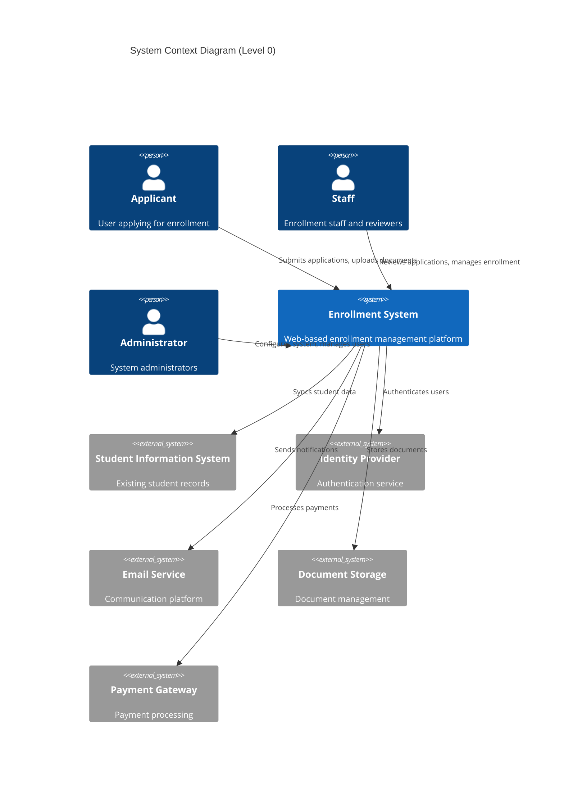

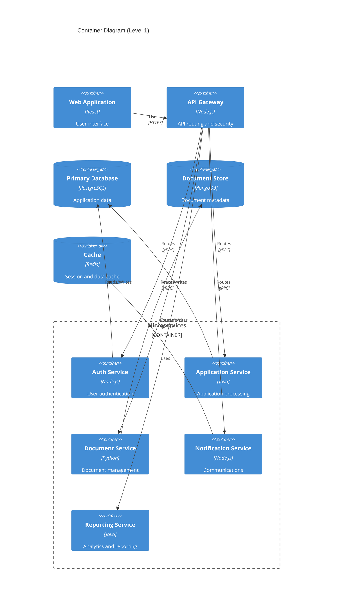

## 2.2 Component Details

### 2.2.1 Core Components

| Component | Purpose | Technology Stack | Scaling Strategy |
|-----------|---------|-----------------|------------------|
| Web Application | User interface and client-side logic | React, Redux, Material-UI | Horizontal scaling with CDN |
| API Gateway | Request routing and API management | Node.js, Express | Horizontal scaling with load balancer |
| Auth Service | Authentication and authorization | Node.js, Passport.js | Horizontal scaling with session replication |
| Application Service | Enrollment processing logic | Java Spring Boot | Horizontal scaling with load distribution |
| Document Service | Document processing and storage | Python FastAPI | Vertical scaling for processing capacity |
| Notification Service | Communication management | Node.js, Bull | Queue-based scaling |
| Reporting Service | Analytics and report generation | Java Spring Batch | Job-based horizontal scaling |

### 2.2.2 Data Components

| Component | Technology | Purpose | Scaling Strategy |
|-----------|------------|---------|------------------|
| Primary Database | PostgreSQL 14 | Transactional data | Primary-replica replication |
| Document Store | MongoDB | Document metadata | Sharding by application ID |
| Cache Layer | Redis Cluster | Session and data caching | Redis cluster with sharding |
| Message Queue | RabbitMQ | Async communication | Clustered deployment |
| Search Engine | Elasticsearch | Full-text search | Multi-node cluster |

## 2.3 Technical Decisions

### 2.3.1 Architecture Patterns

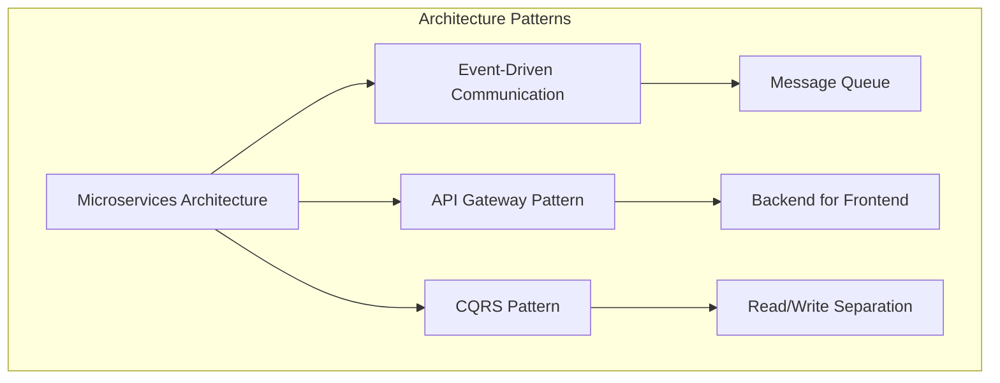

### 2.3.2 Communication Patterns

| Pattern | Use Case | Implementation |
|---------|----------|----------------|
| Synchronous | Real-time operations | REST/gRPC |
| Asynchronous | Background tasks | Message queue |
| Event-driven | Status updates | Event bus |
| Pub/Sub | Notifications | Message broker |
| Streaming | Real-time updates | WebSocket |

## 2.4 Cross-Cutting Concerns

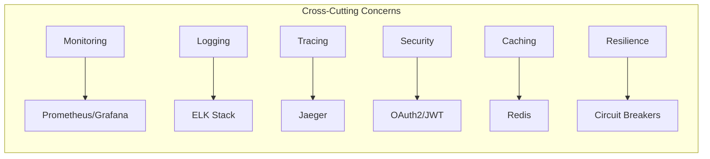

### 2.4.1 Deployment Architecture

```mermaid
C4Deployment
    title Deployment Diagram
    
    Deployment_Node(cdn, "CDN", "CloudFront") {
        Container(static, "Static Assets")
    }
    
    Deployment_Node(cloud, "Cloud Infrastructure", "AWS") {
        Deployment_Node(web_tier, "Web Tier", "ECS") {
            Container(web_app, "Web Application")
        }
        
        Deployment_Node(app_tier, "Application Tier", "ECS") {
            Container(services, "Microservices")
        }
        
        Deployment_Node(data_tier, "Data Tier", "RDS/DocumentDB") {
            ContainerDb(databases, "Databases")
        }
        
        Deployment_Node(cache_tier, "Cache Tier", "ElastiCache") {
            Container(cache, "Redis Cluster")
        }
    }
    
    Rel(cdn, web_tier, "Routes requests")
    Rel(web_tier, app_tier, "API calls")
    Rel(app_tier, data_tier, "Data access")
    Rel(app_tier, cache_tier, "Cache operations")
```

### 2.4.2 Data Flow

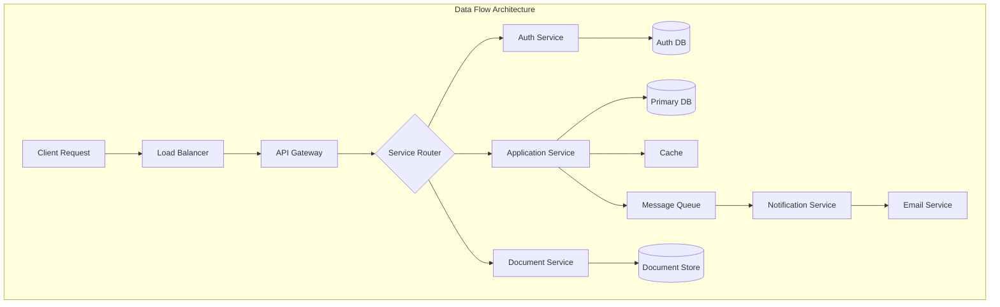

# 3. SYSTEM COMPONENTS ARCHITECTURE

## 3.1 User Interface Design

### 3.1.1 Design Specifications

| Aspect | Requirements |
|--------|--------------|
| Visual Hierarchy | - F-pattern layout for content organization<br>- Z-pattern for landing pages<br>- Maximum 3 levels of information hierarchy<br>- Consistent typography scale (1.2 ratio) |
| Design System | - Material Design 3 implementation<br>- Custom component library extending MD3<br>- Standardized spacing units (4px base)<br>- System-wide color tokens |
| Responsive Design | - Mobile-first approach<br>- Breakpoints: 320px, 768px, 1024px, 1440px<br>- Fluid typography (16px-20px)<br>- Flexible grid system (12 columns) |
| Accessibility | - WCAG 2.1 Level AA compliance<br>- Minimum contrast ratio 4.5:1<br>- Focus indicators<br>- ARIA landmarks and labels |
| Device Support | - Modern browsers (last 2 versions)<br>- iOS 14+, Android 10+<br>- Minimum viewport 320px<br>- Touch-friendly (44px targets) |
| Theming | - Light/dark mode support<br>- High contrast mode<br>- System preference detection<br>- Theme persistence |
| i18n/l10n | - RTL layout support<br>- Unicode font stack<br>- Dynamic text containers<br>- Locale-specific formatting |

### 3.1.2 Interface Elements

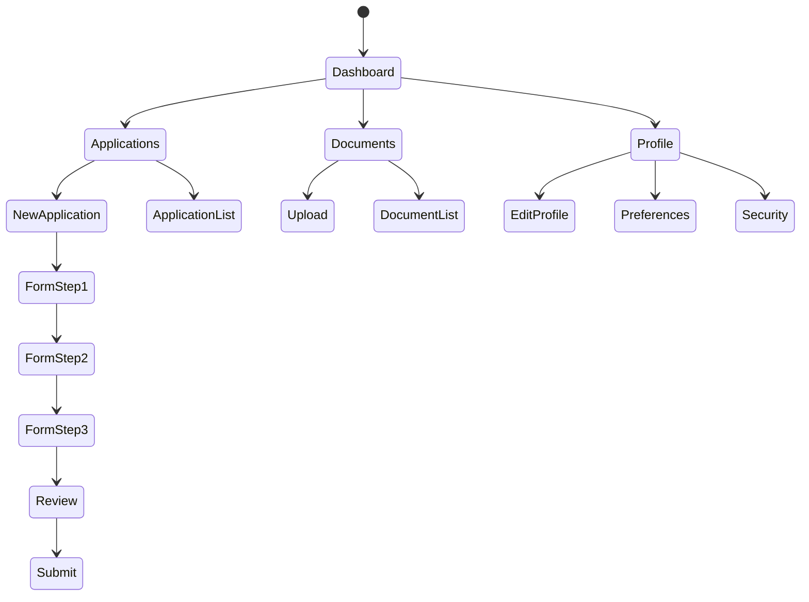

#### Navigation Structure

| Level | Components | Access Control |
|-------|------------|----------------|
| Primary | Dashboard, Applications, Documents, Profile | All authenticated users |
| Secondary | New Application, Application List, Upload, Settings | Role-based |
| Tertiary | Form Steps, Document Details, Profile Sections | Context-based |
| Utility | Help, Notifications, Search | Universal |

#### Critical User Flows

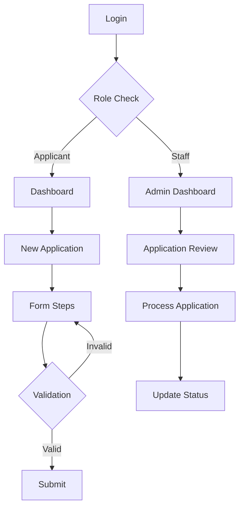

## 3.2 Database Design

### 3.2.1 Schema Design

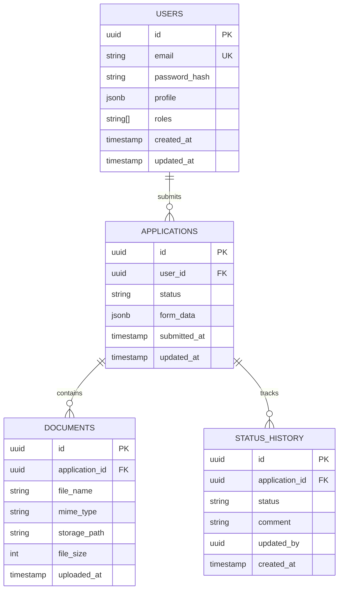

### 3.2.2 Data Management Strategy

| Aspect | Implementation |
|--------|----------------|
| Partitioning | - Time-based partitioning for applications<br>- Hash partitioning for users<br>- Range partitioning for documents |
| Indexing | - B-tree indexes for primary keys<br>- GiST indexes for search fields<br>- Partial indexes for active records |
| Migrations | - Forward-only migrations<br>- Version control integration<br>- Automated testing<br>- Rollback procedures |
| Archival | - Yearly archival of completed applications<br>- Cold storage for old documents<br>- Compliance-based retention |
| Auditing | - Temporal tables for history<br>- Change data capture<br>- Audit logging for sensitive operations |

## 3.3 API Design

### 3.3.1 API Architecture

```mermaid
flowchart LR
    subgraph Client Layer
        Web[Web App]
        Mobile[Mobile App]
    end
    
    subgraph API Gateway
        Auth[Authentication]
        Rate[Rate Limiting]
        Cache[Cache]
    end
    
    subgraph Services
        Users[User Service]
        Apps[Application Service]
        Docs[Document Service]
        Notify[Notification Service]
    end
    
    Web --> API Gateway
    Mobile --> API Gateway
    
    API Gateway --> Users
    API Gateway --> Apps
    API Gateway --> Docs
    API Gateway --> Notify
```

### 3.3.2 Interface Specifications

| Endpoint Category | Base Path | Version Strategy | Rate Limit |
|------------------|-----------|------------------|------------|
| Public API | /api/public | URI versioning (v1) | 100/min |
| Internal API | /api/internal | Header versioning | 1000/min |
| Admin API | /api/admin | URI versioning (v1) | 50/min |
| Webhook API | /api/webhooks | None | 10/min |

#### Authentication Flow

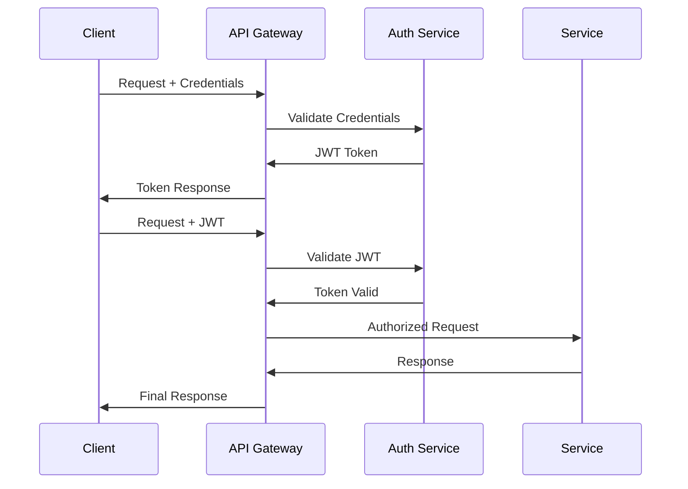

# 4. TECHNOLOGY STACK

## 4.1 PROGRAMMING LANGUAGES

| Platform/Component | Language | Version | Justification |
|-------------------|----------|---------|---------------|
| Frontend | TypeScript | 5.0+ | - Strong typing for large-scale application<br>- Enhanced IDE support<br>- Better maintainability |
| API Gateway | Node.js | 20 LTS | - High performance for I/O operations<br>- Extensive middleware ecosystem<br>- Efficient request handling |
| Application Services | Java | 17 LTS | - Enterprise-grade stability<br>- Strong concurrency support<br>- Extensive educational sector libraries |
| Document Service | Python | 3.11+ | - Rich document processing libraries<br>- ML/AI capabilities for future features<br>- Rapid development |
| Notification Service | Node.js | 20 LTS | - Asynchronous processing<br>- Event-driven architecture support<br>- WebSocket capabilities |

## 4.2 FRAMEWORKS & LIBRARIES

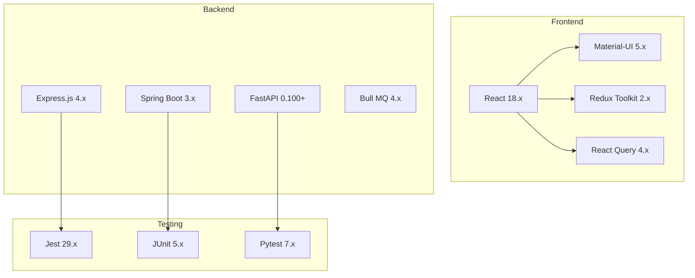

### Core Frameworks

| Layer | Framework | Version | Purpose |
|-------|-----------|---------|---------|
| Frontend Web | React | 18.x | - Component-based architecture<br>- Virtual DOM for performance<br>- Large ecosystem |
| UI Components | Material-UI | 5.x | - WCAG 2.1 compliance<br>- Responsive design support<br>- Customizable theming |
| API Gateway | Express.js | 4.x | - Robust routing<br>- Middleware support<br>- Easy integration |
| Application Services | Spring Boot | 3.x | - Enterprise features<br>- Security framework<br>- Transaction management |
| Document Service | FastAPI | 0.100+ | - Async support<br>- OpenAPI integration<br>- High performance |

## 4.3 DATABASES & STORAGE

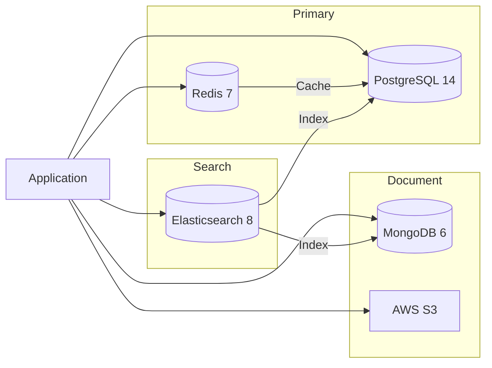

| Type | Technology | Version | Purpose |
|------|------------|---------|---------|
| Primary Database | PostgreSQL | 14+ | - ACID compliance<br>- Complex queries<br>- Data integrity |
| Document Store | MongoDB | 6.0+ | - Flexible schema<br>- Document storage<br>- Horizontal scaling |
| Cache Layer | Redis | 7.0+ | - Session management<br>- Query caching<br>- Rate limiting |
| Object Storage | AWS S3 | - | - Document storage<br>- Backup storage<br>- Static assets |
| Search Engine | Elasticsearch | 8.0+ | - Full-text search<br>- Analytics<br>- Logging |

## 4.4 THIRD-PARTY SERVICES

| Category | Service | Purpose | Integration Method |
|----------|---------|---------|-------------------|
| Authentication | Auth0 | Identity management | OIDC/OAuth2 |
| Email | SendGrid | Transactional emails | REST API |
| SMS | Twilio | Mobile notifications | REST API |
| Monitoring | Datadog | Application monitoring | Agent-based |
| Analytics | Google Analytics | User behavior tracking | JavaScript SDK |
| CDN | Cloudflare | Content delivery | DNS/Proxy |
| Cloud Platform | AWS | Infrastructure hosting | SDK/API |

## 4.5 DEVELOPMENT & DEPLOYMENT

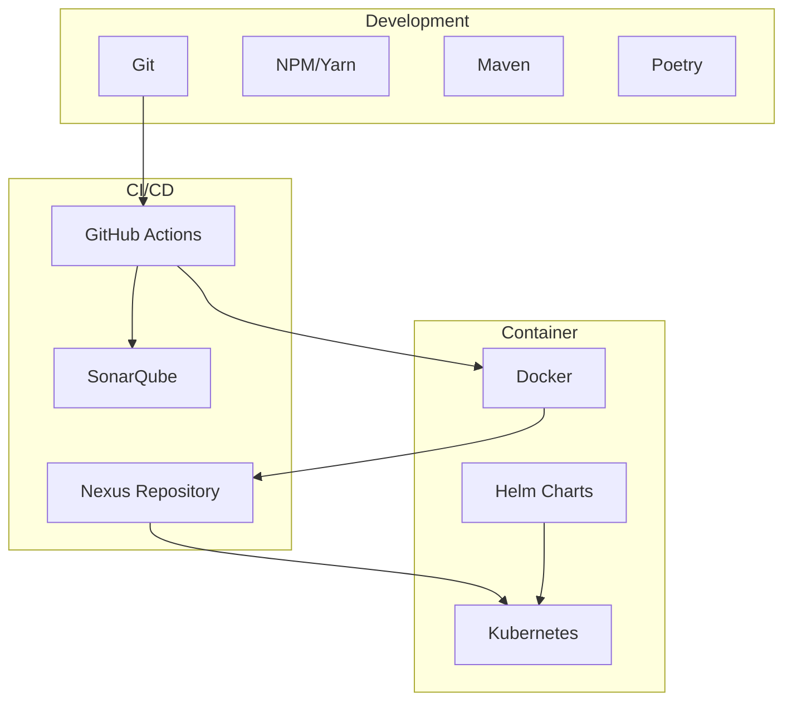

### Development Tools

| Category | Tool | Version | Purpose |
|----------|------|---------|----------|
| Version Control | Git | 2.40+ | Source control |
| IDE | VS Code | Latest | Development environment |
| API Testing | Postman | Latest | API development/testing |
| Code Quality | SonarQube | 9.x | Static code analysis |
| Package Management | NPM/Maven/Poetry | Latest | Dependency management |

### Deployment Pipeline

| Stage | Tools | Purpose |
|-------|-------|---------|
| Build | GitHub Actions | CI/CD automation |
| Testing | Jest/JUnit/Pytest | Automated testing |
| Security | OWASP/Snyk | Security scanning |
| Containerization | Docker | Application packaging |
| Orchestration | Kubernetes | Container orchestration |
| Configuration | Helm | Deployment management |
| Monitoring | Prometheus/Grafana | System monitoring |

# 5. SYSTEM DESIGN

## 5.1 User Interface Design

### 5.1.1 Layout Structure

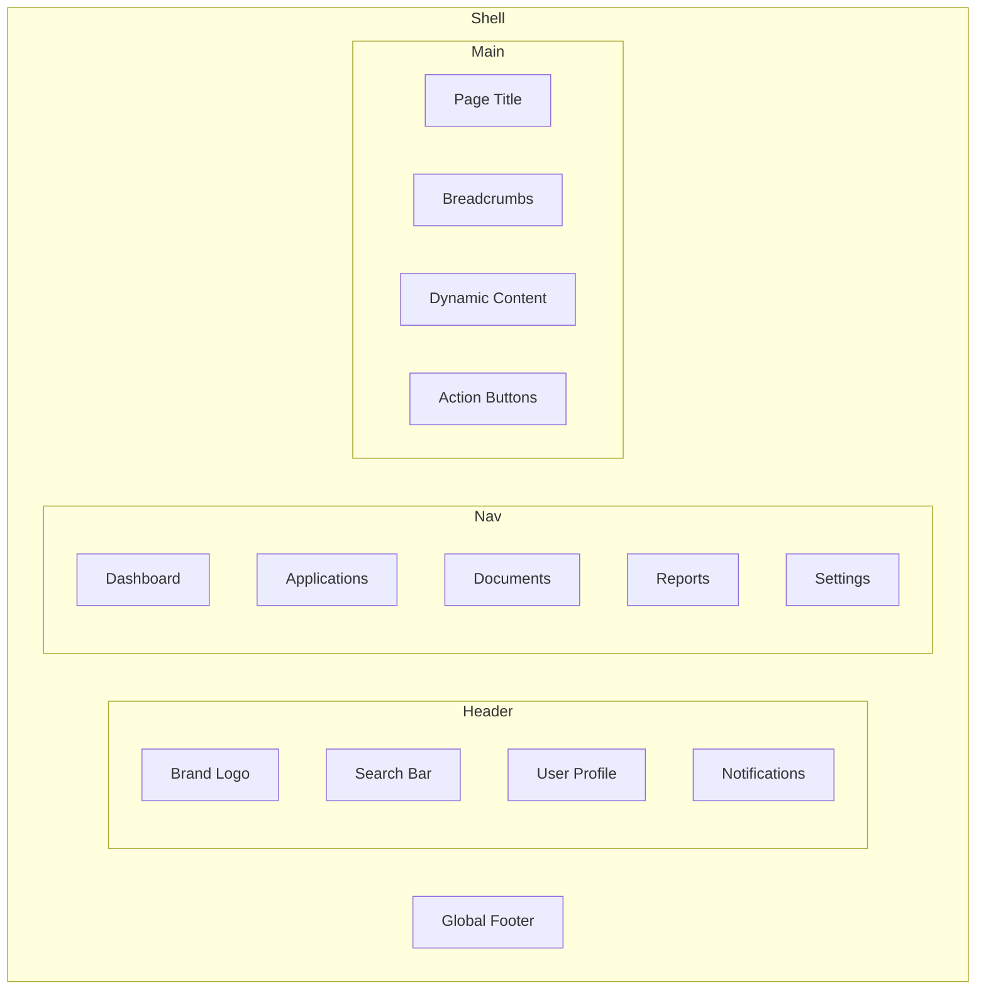

### 5.1.2 Component Specifications

| Component | Layout | Behavior | Accessibility |
|-----------|---------|-----------|---------------|
| Global Header | Fixed top, 64px height | Sticky on scroll | Role="banner" |
| Navigation | Left sidebar, 240px width | Collapsible | Role="navigation" |
| Content Area | Fluid width, max 1440px | Scrollable | Role="main" |
| Action Buttons | Fixed bottom right | Float above content | Aria-labels |
| Modal Dialogs | Centered, max 600px width | Focus trap | Role="dialog" |

### 5.1.3 Key Screens

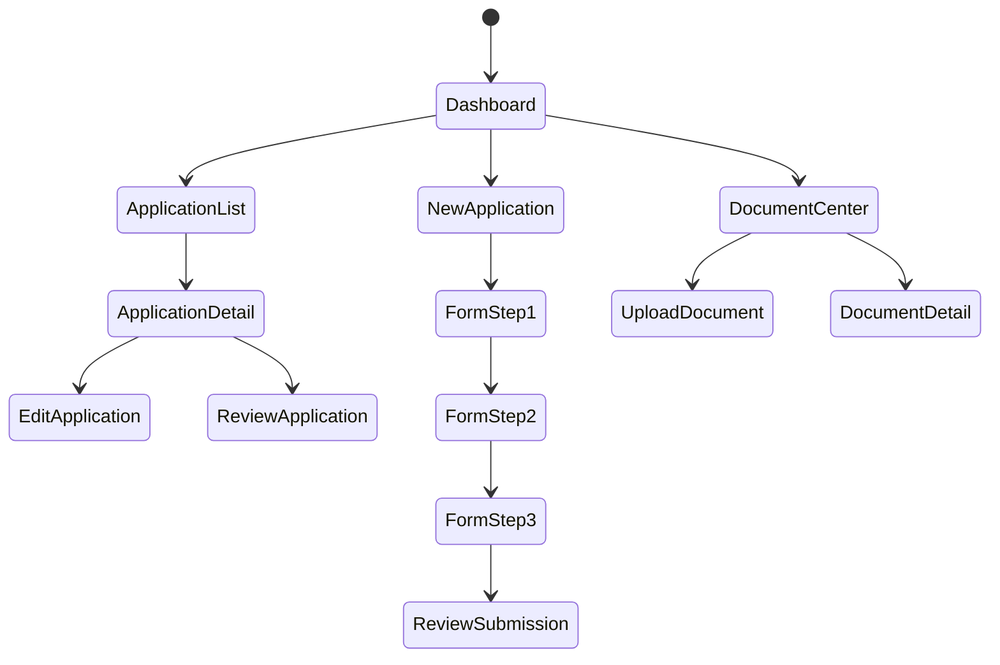

## 5.2 Database Design

### 5.2.1 Logical Data Model

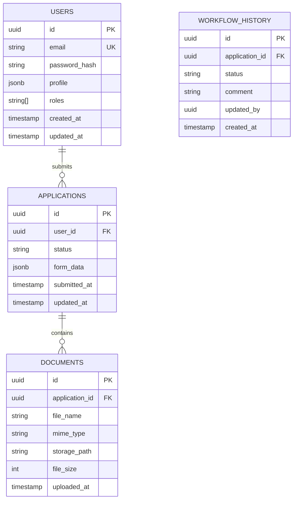

### 5.2.2 Physical Data Model

| Table | Storage | Partitioning | Indexes |
|-------|---------|--------------|----------|
| users | PostgreSQL | None | btree(id, email), gin(profile) |
| applications | PostgreSQL | Range(submitted_at) | btree(id, user_id, status) |
| documents | MongoDB | Hash(application_id) | btree(id, application_id) |
| workflow_history | TimescaleDB | Time(created_at) | btree(id, application_id) |

### 5.2.3 Data Access Patterns

| Operation | Access Pattern | Caching Strategy |
|-----------|---------------|------------------|
| User Authentication | Key-Value Lookup | Redis Session Cache |
| Application List | Paginated Query | Redis Result Cache |
| Document Retrieval | Direct Key Lookup | CDN Cache |
| Status Updates | Stream Processing | None |
| Report Generation | Batch Processing | Materialized Views |

## 5.3 API Design

### 5.3.1 API Architecture

```mermaid
flowchart TD
    subgraph Client Layer
        Web[Web Application]
        Mobile[Mobile Client]
    end
    
    subgraph API Gateway
        Auth[Authentication]
        Rate[Rate Limiting]
        Cache[Response Cache]
    end
    
    subgraph Services
        Users[User Service]
        Apps[Application Service]
        Docs[Document Service]
        Workflow[Workflow Service]
    end
    
    Web --> API Gateway
    Mobile --> API Gateway
    
    API Gateway --> Users
    API Gateway --> Apps
    API Gateway --> Docs
    API Gateway --> Workflow
```

### 5.3.2 Service Interfaces

| Service | Protocol | Authentication | Rate Limit |
|---------|----------|----------------|------------|
| User Service | gRPC | JWT | 1000/min |
| Application Service | gRPC | JWT | 500/min |
| Document Service | gRPC/REST | JWT | 200/min |
| Workflow Service | gRPC | JWT | 300/min |

### 5.3.3 API Endpoints

| Endpoint | Method | Purpose | Request Format |
|----------|---------|---------|----------------|
| /api/v1/applications | POST | Create application | JSON |
| /api/v1/applications/{id} | GET | Retrieve application | - |
| /api/v1/documents | POST | Upload document | Multipart |
| /api/v1/workflow/{id}/status | PUT | Update status | JSON |

### 5.3.4 Message Formats

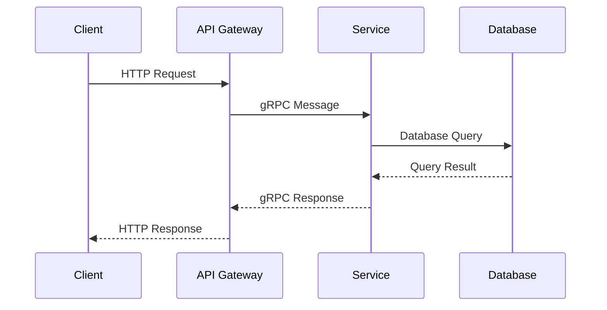

# 6. USER INTERFACE DESIGN

## 6.1 Design System Key

```
Icons:
[?] - Help/Information tooltip
[$] - Payment/Financial
[i] - Information
[+] - Add/Create new
[x] - Close/Delete/Remove
[<] [>] - Navigation/Pagination
[^] - Upload
[#] - Menu/Dashboard
[@] - User profile
[!] - Alert/Warning
[=] - Settings menu
[*] - Favorite/Important

Interactive Elements:
[ ] - Checkbox
( ) - Radio button
[Button] - Clickable button
[...] - Text input field
[====] - Progress indicator
[v] - Dropdown menu
```

## 6.2 Main Dashboard

```
+----------------------------------------------------------+
|  Enrollment System [#]                    [@] Admin [=]    |
+----------------------------------------------------------+
|                                                           |
|  Welcome back, John Smith                     [!] 3 Alerts|
|                                                           |
|  +-------------------+  +----------------------+          |
|  | Applications      |  | Quick Actions        |          |
|  |                   |  |                      |          |
|  | Active: 12        |  | [+] New Application  |          |
|  | Pending: 5        |  | [^] Upload Document  |          |
|  | Completed: 45     |  | [$] Process Payment  |          |
|  +-------------------+  +----------------------+          |
|                                                           |
|  +-------------------+  +----------------------+          |
|  | Recent Activity   |  | System Status        |          |
|  |                   |  |                      |          |
|  | > App #1242 [*]   |  | Database: [====] OK  |          |
|  | > Doc Upload      |  | Storage:  [====-] 90%|          |
|  | > Status Update   |  | Services: [====] OK  |          |
|  +-------------------+  +----------------------+          |
|                                                           |
+----------------------------------------------------------+
```

## 6.3 Application Form

```
+----------------------------------------------------------+
|  New Application [?]                        [@] User [x]   |
+----------------------------------------------------------+
|                                                           |
|  Progress: [===========----------] 50%                    |
|                                                           |
|  +----------------------+                                 |
|  | Personal Information |                                 |
|  +----------------------+                                 |
|                                                           |
|  Full Name:  [............................]              |
|  Email:      [............................]              |
|                                                           |
|  Program Selection:                                       |
|  ( ) Undergraduate                                        |
|  ( ) Graduate                                             |
|  ( ) Certificate                                          |
|                                                           |
|  Term: [v]                                               |
|        Fall 2024                                          |
|        Spring 2025                                        |
|        Summer 2025                                        |
|                                                           |
|  Documents:                                               |
|  [x] Transcript [^]                                       |
|  [ ] ID Proof  [^]                                       |
|  [ ] Resume    [^]                                       |
|                                                           |
|  [< Back]                [Save Draft]        [Continue >] |
+----------------------------------------------------------+
```

## 6.4 Document Management

```
+----------------------------------------------------------+
|  Document Center                            [@] User [=]   |
+----------------------------------------------------------+
|                                                           |
|  +------------------------+  +----------------------+      |
|  | Upload Documents [^]   |  | Recent Uploads       |      |
|  +------------------------+  +----------------------+      |
|                                                           |
|  Drag files here or click to upload                      |
|  +------------------------+                               |
|  |                        |                               |
|  |     Drop Zone         |                               |
|  |                        |                               |
|  +------------------------+                               |
|                                                           |
|  Document List:                                          |
|  +------------------------+-------------------------+      |
|  | Name          | Type    | Status     | Actions  |      |
|  |---------------+---------+-----------+----------|      |
|  | transcript.pdf| Academic| Verified   | [x] [?]  |      |
|  | passport.jpg  | ID      | Pending    | [x] [?]  |      |
|  | resume.doc    | Other   | Rejected   | [x] [?]  |      |
|  +------------------------+-------------------------+      |
|                                                           |
|  [< Back]                              [Upload Selected]  |
+----------------------------------------------------------+
```

## 6.5 Status Tracking

```
+----------------------------------------------------------+
|  Application Status                        [@] User [i]    |
+----------------------------------------------------------+
|                                                           |
|  Application #1242                                        |
|                                                           |
|  +--------------------+                                   |
|  | Status: IN REVIEW  |                                   |
|  +--------------------+                                   |
|                                                           |
|  Timeline:                                               |
|  +----------------------------------------------------------+
|  | [====] Submitted         09/15/2023 10:30 AM              |
|  |   |                                                       |
|  | [====] Documents Verified 09/16/2023 02:15 PM            |
|  |   |                                                       |
|  | [====] Under Review      09/17/2023 11:45 AM             |
|  |   |                                                       |
|  | [----] Decision Pending                                   |
|  |   |                                                       |
|  | [----] Completed                                         |
|  +----------------------------------------------------------+
|                                                           |
|  [View Details]            [Contact Support]    [Print]   |
+----------------------------------------------------------+
```

## 6.6 Responsive Design Breakpoints

| Breakpoint | Width | Layout Adjustments |
|------------|-------|-------------------|
| Mobile | 320px - 767px | Single column, stacked components |
| Tablet | 768px - 1023px | Two column, condensed navigation |
| Desktop | 1024px - 1439px | Full layout, expanded features |
| Large | 1440px+ | Optimized for wide screens |

## 6.7 Accessibility Features

- High contrast mode support
- Keyboard navigation with visible focus indicators
- ARIA labels on all interactive elements
- Screen reader compatibility
- Minimum touch target size of 44x44px
- Text scaling support up to 200%
- Color-blind friendly status indicators

## 6.8 Component Specifications

| Component | Framework | Styling | State Management |
|-----------|-----------|---------|------------------|
| Forms | React Hook Form | Material-UI | Redux Form |
| Tables | Material Table | Custom CSS | Local State |
| Modals | Material Dialog | Theme Based | Context API |
| Navigation | React Router | Material Drawer | Redux |
| File Upload | React Dropzone | Custom CSS | Redux |
| Charts | Recharts | Theme Based | Redux |

# 7. SECURITY CONSIDERATIONS

## 7.1 Authentication and Authorization

### 7.1.1 Authentication Methods

| Method | Implementation | Use Case |
|--------|----------------|-----------|
| Password-based | Argon2id hashing with salt | Primary authentication |
| Multi-factor (MFA) | Time-based OTP (TOTP) | High-privilege accounts |
| Single Sign-On | SAML 2.0 with institutional IdP | Staff and faculty |
| API Authentication | JWT with RSA-256 signatures | Service-to-service |
| Session Management | Redis-backed encrypted tokens | Web session handling |

### 7.1.2 Authorization Model

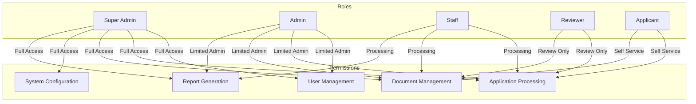

## 7.2 Data Security

### 7.2.1 Encryption Standards

| Data State | Method | Key Management |
|------------|---------|----------------|
| In Transit | TLS 1.3 | AWS Certificate Manager |
| At Rest | AES-256-GCM | AWS KMS |
| Database | Column-level TDE | PostgreSQL native |
| File Storage | Server-side encryption | S3 managed keys |
| Backup Data | AES-256-CBC | Offline key storage |

### 7.2.2 Data Classification

```mermaid
graph TD
    subgraph Classification Levels
        L1[Level 1: Public]
        L2[Level 2: Internal]
        L3[Level 3: Confidential]
        L4[Level 4: Restricted]
    end
    
    subgraph Security Controls
        C1[Basic Controls]
        C2[Enhanced Controls]
        C3[Strong Controls]
        C4[Maximum Controls]
    end
    
    L1 --> C1
    L2 --> C2
    L3 --> C3
    L4 --> C4
    
    C1 --> M1[Standard Encryption]
    C2 --> M2[Enhanced Logging]
    C3 --> M3[Access Controls]
    C4 --> M4[MFA Required]
```

## 7.3 Security Protocols

### 7.3.1 Access Control Policies

| Control Type | Implementation | Monitoring |
|--------------|----------------|------------|
| Network Access | AWS Security Groups | CloudWatch Logs |
| Application Access | Role-based ACL | Audit Logging |
| Database Access | Row-level Security | Query Logging |
| API Access | OAuth 2.0 Scopes | Request Tracing |
| File Access | S3 Bucket Policies | Access Logging |

### 7.3.2 Security Monitoring

```mermaid
flowchart LR
    subgraph Detection
        IDS[Intrusion Detection]
        WAF[Web Application Firewall]
        SIEM[Security Information]
    end
    
    subgraph Response
        Alert[Alert Generation]
        Block[Threat Blocking]
        Log[Security Logging]
    end
    
    subgraph Analysis
        Review[Log Review]
        Audit[Security Audit]
        Report[Compliance Reporting]
    end
    
    IDS --> Alert
    WAF --> Block
    SIEM --> Log
    
    Alert --> Review
    Block --> Audit
    Log --> Report
```

### 7.3.3 Compliance Requirements

| Requirement | Standard | Implementation |
|-------------|----------|----------------|
| Data Privacy | GDPR/CCPA | Data encryption, access controls |
| Educational Records | FERPA | Role-based access, audit trails |
| Security Controls | ISO 27001 | Security policies, procedures |
| Authentication | NIST 800-63B | MFA, password policies |
| Audit Logging | SOC 2 | Comprehensive logging, retention |

### 7.3.4 Incident Response

```mermaid
stateDiagram-v2
    [*] --> Detection
    Detection --> Analysis
    Analysis --> Containment
    Containment --> Eradication
    Eradication --> Recovery
    Recovery --> PostIncident
    PostIncident --> [*]
    
    state Detection {
        Monitoring --> Alert
        Alert --> Verification
    }
    
    state Analysis {
        Investigation --> Impact
        Impact --> Strategy
    }
    
    state Recovery {
        Restore --> Validate
        Validate --> Monitor
    }
```

### 7.3.5 Security Testing

| Test Type | Frequency | Tools |
|-----------|-----------|-------|
| Penetration Testing | Quarterly | Burp Suite, OWASP ZAP |
| Vulnerability Scanning | Weekly | Nessus, OpenVAS |
| Code Security Analysis | Per Commit | SonarQube, Checkmarx |
| Dependency Scanning | Daily | Snyk, OWASP Dependency-Check |
| Security Compliance | Monthly | AWS Security Hub |

# 8. INFRASTRUCTURE

## 8.1 DEPLOYMENT ENVIRONMENT

```mermaid
flowchart TD
    subgraph Production
        LB[AWS ALB] --> WEB[Web Tier]
        WEB --> APP[Application Tier]
        APP --> DB[(Data Tier)]
        APP --> CACHE[(Cache Tier)]
    end
    
    subgraph Staging
        SLB[AWS ALB] --> SWEB[Web Tier]
        SWEB --> SAPP[Application Tier]
        SAPP --> SDB[(Data Tier)]
        SAPP --> SCACHE[(Cache Tier)]
    end
    
    subgraph Development
        DLB[AWS ALB] --> DWEB[Web Tier]
        DWEB --> DAPP[Application Tier]
        DAPP --> DDB[(Data Tier)]
        DAPP --> DCACHE[(Cache Tier)]
    end
```

| Environment | Purpose | Infrastructure | Scaling |
|-------------|---------|----------------|----------|
| Production | Live system | AWS (Primary Region) | Auto-scaling groups |
| Staging | Pre-production testing | AWS (Secondary Region) | Fixed capacity |
| Development | Development and testing | AWS (Secondary Region) | Minimal capacity |
| DR Site | Disaster recovery | AWS (Tertiary Region) | Warm standby |

## 8.2 CLOUD SERVICES

| Service Category | AWS Service | Purpose | Configuration |
|-----------------|-------------|----------|---------------|
| Compute | ECS Fargate | Container hosting | Serverless containers |
| Database | RDS PostgreSQL | Primary database | Multi-AZ deployment |
| Document Store | DocumentDB | Document storage | Replica set with 3 nodes |
| Cache | ElastiCache | Redis caching | Cluster mode enabled |
| Storage | S3 | Document storage | Standard tier with lifecycle |
| CDN | CloudFront | Static content delivery | Edge locations worldwide |
| DNS | Route 53 | DNS management | Active-active routing |
| Security | WAF & Shield | DDoS protection | Enterprise protection |
| Monitoring | CloudWatch | System monitoring | Enhanced monitoring |
| Secrets | Secrets Manager | Credentials management | Automatic rotation |

## 8.3 CONTAINERIZATION

```mermaid
graph TD
    subgraph Container Architecture
        A[Base Image] --> B[Runtime Image]
        B --> C[Application Image]
        C --> D[Service Container]
    end
    
    subgraph Image Layers
        E[OS Layer]
        F[Runtime Layer]
        G[Dependencies Layer]
        H[Application Layer]
    end
    
    A --> E
    B --> F
    C --> G
    D --> H
```

| Component | Image Specification | Base Image | Size Limit |
|-----------|-------------------|-------------|------------|
| Web App | nginx:alpine | Alpine 3.18 | 250MB |
| API Gateway | node:18-alpine | Alpine 3.18 | 300MB |
| Application Services | eclipse-temurin:17-jre-alpine | Alpine 3.18 | 400MB |
| Document Service | python:3.11-slim | Debian Slim | 350MB |
| Notification Service | node:18-alpine | Alpine 3.18 | 250MB |

## 8.4 ORCHESTRATION

```mermaid
flowchart TD
    subgraph ECS Cluster
        direction TB
        A[Service Discovery] --> B[Task Definition]
        B --> C[Container Definition]
        C --> D[Service]
        D --> E[Task]
    end
    
    subgraph Load Balancing
        F[ALB] --> G[Target Group]
        G --> D
    end
    
    subgraph Auto Scaling
        H[Scaling Policy] --> I[Service Auto Scaling]
        I --> D
    end
```

| Component | Configuration | Scaling Policy | Health Check |
|-----------|--------------|----------------|--------------|
| Web Tier | Min: 2, Max: 10 | CPU > 70% | HTTP 200 |
| API Gateway | Min: 2, Max: 8 | Request Count | TCP Port |
| Application Services | Min: 3, Max: 12 | Memory > 80% | HTTP 200 |
| Document Service | Min: 2, Max: 6 | Queue Length | HTTP 200 |
| Notification Service | Min: 2, Max: 4 | Message Count | TCP Port |

## 8.5 CI/CD PIPELINE

```mermaid
flowchart LR
    subgraph Source
        A[GitHub Repository]
    end
    
    subgraph Build
        B[Build Code]
        C[Run Tests]
        D[Security Scan]
        E[Build Image]
    end
    
    subgraph Deploy
        F[Push Image]
        G[Deploy Dev]
        H[Deploy Staging]
        I[Deploy Prod]
    end
    
    A --> B
    B --> C
    C --> D
    D --> E
    E --> F
    F --> G
    G --> H
    H --> I
```

| Stage | Tools | Actions | Success Criteria |
|-------|-------|---------|-----------------|
| Source Control | GitHub | Code commit, PR review | PR approval |
| Build | GitHub Actions | Compile, test, scan | All tests pass |
| Security | SonarQube, Snyk | Code analysis, vulnerability scan | No critical issues |
| Artifact | ECR | Container image build and push | Image scan pass |
| Deployment Dev | AWS CDK | Infrastructure deployment | Health check pass |
| Deployment Staging | AWS CDK | Automated deployment | Integration tests pass |
| Deployment Prod | AWS CDK | Manual approval, deployment | Smoke tests pass |
| Monitoring | CloudWatch | Performance monitoring | No alerts |

# APPENDICES

## A.1 Additional Technical Information

### A.1.1 Browser Support Matrix

| Browser | Minimum Version | Notes |
|---------|----------------|-------|
| Chrome | 90+ | Full feature support |
| Firefox | 88+ | Full feature support |
| Safari | 14+ | Limited WebSocket support |
| Edge | 90+ | Full feature support |
| Mobile Chrome | 90+ | Touch optimization required |
| Mobile Safari | 14+ | iOS-specific gestures |

### A.1.2 Performance Benchmarks

```mermaid
gantt
    title Response Time Targets
    dateFormat X
    axisFormat %s
    
    section API Calls
    Authentication    :0, 0.3s
    Data Retrieval   :0, 0.5s
    File Upload      :0, 3s
    Report Generation:0, 5s
    
    section Page Loads
    Initial Load     :0, 2s
    Route Change     :0, 0.5s
    Form Submit      :0, 1s
    Document Preview :0, 2s
```

### A.1.3 Error Code Reference

| Code Range | Category | Example |
|------------|----------|---------|
| 1000-1999 | Authentication | 1001: Invalid credentials |
| 2000-2999 | Application Processing | 2001: Missing required field |
| 3000-3999 | Document Management | 3001: Upload failed |
| 4000-4999 | Workflow | 4001: Invalid status transition |
| 5000-5999 | System | 5001: Database connection error |

## A.2 GLOSSARY

| Term | Definition |
|------|------------|
| Artifact Repository | Storage system for build outputs and dependencies |
| Circuit Breaker | Design pattern that prevents cascading failures |
| Content Delivery Network (CDN) | Distributed network for serving static content |
| Data Lake | Storage repository for raw data |
| Event Sourcing | Pattern of storing state changes as events |
| Feature Flag | Configuration toggle for enabling/disabling functionality |
| Health Check | Automated system status verification |
| Idempotency | Property where operations can be safely repeated |
| Load Balancer | System that distributes network traffic |
| Message Queue | System for asynchronous communication between services |
| Rate Limiting | Controlling frequency of API requests |
| Sharding | Database partitioning across multiple instances |
| Time-To-Live (TTL) | Duration for which data remains valid |
| Webhook | HTTP callback for event notifications |
| Zero Downtime Deployment | Deployment without service interruption |

## A.3 ACRONYMS

| Acronym | Full Form |
|---------|-----------|
| ACID | Atomicity, Consistency, Isolation, Durability |
| ALB | Application Load Balancer |
| API | Application Programming Interface |
| CDK | Cloud Development Kit |
| CDN | Content Delivery Network |
| CORS | Cross-Origin Resource Sharing |
| CRUD | Create, Read, Update, Delete |
| DNS | Domain Name System |
| ECS | Elastic Container Service |
| ETL | Extract, Transform, Load |
| GDPR | General Data Protection Regulation |
| gRPC | Google Remote Procedure Call |
| HMAC | Hash-based Message Authentication Code |
| IOPS | Input/Output Operations Per Second |
| JWT | JSON Web Token |
| K8s | Kubernetes |
| MFA | Multi-Factor Authentication |
| MIME | Multipurpose Internet Mail Extensions |
| mTLS | Mutual Transport Layer Security |
| OIDC | OpenID Connect |
| ORM | Object-Relational Mapping |
| RBAC | Role-Based Access Control |
| REST | Representational State Transfer |
| RTO | Recovery Time Objective |
| SAML | Security Assertion Markup Language |
| SDK | Software Development Kit |
| SLA | Service Level Agreement |
| SMTP | Simple Mail Transfer Protocol |
| SQL | Structured Query Language |
| SSO | Single Sign-On |
| TDE | Transparent Data Encryption |
| TLS | Transport Layer Security |
| URI | Uniform Resource Identifier |
| UUID | Universally Unique Identifier |
| VPC | Virtual Private Cloud |
| WAF | Web Application Firewall |
| WCAG | Web Content Accessibility Guidelines |
| XSS | Cross-Site Scripting |